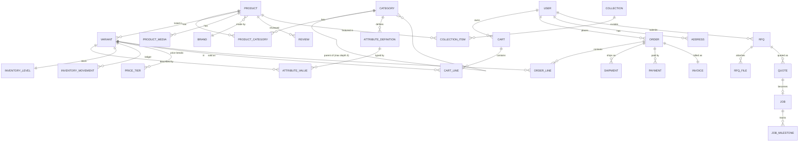

# OnlyParts — Data Model

**Version:** 1.0
**Database:** PostgreSQL 16 · extensions: `pgcrypto`, `ltree`, `pg_trgm`, `citext`
**ORM:** Prisma

All money is `integer` **paise**. All timestamps are `timestamptz` in UTC.

---

## 1. Entity relationship overview



---

## 2. Catalog

### 2.1 `categories`

```sql
CREATE TABLE categories (
  id            uuid PRIMARY KEY DEFAULT gen_random_uuid(),
  parent_id     uuid REFERENCES categories(id) ON DELETE RESTRICT,
  slug          citext NOT NULL UNIQUE,
  name          text NOT NULL,
  depth         smallint NOT NULL,
  path          ltree NOT NULL,               -- 'fasteners.screws_by_head.socket_head'
  description   text,
  icon_key      text,                          -- maps to the custom icon set
  hero_image_id uuid REFERENCES media(id),
  position      integer NOT NULL DEFAULT 0,
  is_active     boolean NOT NULL DEFAULT true,
  seo_title     text,
  seo_description text,
  product_count integer NOT NULL DEFAULT 0,    -- denormalised, refreshed by job
  created_at    timestamptz NOT NULL DEFAULT now(),
  updated_at    timestamptz NOT NULL DEFAULT now(),
  deleted_at    timestamptz,

  CONSTRAINT depth_max_3 CHECK (depth BETWEEN 1 AND 3),
  CONSTRAINT root_has_no_parent CHECK ((depth = 1) = (parent_id IS NULL))
);
CREATE INDEX ON categories USING gist (path);
CREATE INDEX ON categories (parent_id, position) WHERE deleted_at IS NULL;
```

`depth` and `path` are maintained by a trigger on insert/update of `parent_id`. Subtree query: `WHERE path <@ 'fasteners'`.

### 2.2 `products` and `variants`

A **product** is the merchandising unit ("M3 Hex Socket Head Cap Screw, SS304"). A **variant** is the purchasable unit ("M3 × 10 mm"). Products with a single configuration still get exactly one variant — no special-casing anywhere downstream.

```sql
CREATE TABLE products (
  id            uuid PRIMARY KEY DEFAULT gen_random_uuid(),
  slug          citext NOT NULL UNIQUE,
  title         text NOT NULL,
  subtitle      text,
  description   text,                          -- markdown
  brand_id      uuid REFERENCES brands(id),
  hsn_code      text NOT NULL,
  gst_rate      numeric(4,2) NOT NULL DEFAULT 18.00,
  status        product_status NOT NULL DEFAULT 'draft',  -- draft|active|archived
  variant_axes  text[] NOT NULL DEFAULT '{}',  -- ['thread','length_mm'] — drives the matrix UI
  is_made_to_order boolean NOT NULL DEFAULT false,
  lead_time_days integer,
  rating_avg    numeric(3,2),
  rating_count  integer NOT NULL DEFAULT 0,
  search_boost  real NOT NULL DEFAULT 1.0,     -- manual merchandising lever
  seo_title     text,
  seo_description text,
  published_at  timestamptz,
  created_at    timestamptz NOT NULL DEFAULT now(),
  updated_at    timestamptz NOT NULL DEFAULT now(),
  deleted_at    timestamptz
);

CREATE TABLE variants (
  id            uuid PRIMARY KEY DEFAULT gen_random_uuid(),
  product_id    uuid NOT NULL REFERENCES products(id) ON DELETE CASCADE,
  sku           citext NOT NULL UNIQUE,        -- FS-SHC-M3-010-SS304
  mpn           text,
  barcode       text,
  title_suffix  text,                          -- '10mm'
  position      integer NOT NULL DEFAULT 0,
  base_price    integer NOT NULL,              -- paise, GST-inclusive, tier-1
  compare_at    integer,                       -- for the strike-through
  cost_price    integer,                       -- internal only, never serialised publicly
  weight_g      integer NOT NULL,
  length_mm     numeric(10,2),
  width_mm      numeric(10,2),
  height_mm     numeric(10,2),
  pack_size     integer NOT NULL DEFAULT 1,    -- sold in packs of N
  moq           integer NOT NULL DEFAULT 1,    -- 1 = no MOQ, which is the norm here
  qty_increment integer NOT NULL DEFAULT 1,
  is_active     boolean NOT NULL DEFAULT true,
  created_at    timestamptz NOT NULL DEFAULT now(),
  updated_at    timestamptz NOT NULL DEFAULT now(),
  deleted_at    timestamptz
);
CREATE INDEX ON variants (product_id, position);
CREATE INDEX ON variants USING gin (sku gin_trgm_ops);
```

### 2.3 `product_categories` — the many-to-many

```sql
CREATE TABLE product_categories (
  product_id  uuid NOT NULL REFERENCES products(id) ON DELETE CASCADE,
  category_id uuid NOT NULL REFERENCES categories(id) ON DELETE CASCADE,
  is_primary  boolean NOT NULL DEFAULT false,
  position    integer NOT NULL DEFAULT 0,
  PRIMARY KEY (product_id, category_id)
);

-- exactly one primary per product
CREATE UNIQUE INDEX one_primary_category_per_product
  ON product_categories (product_id) WHERE is_primary;

CREATE INDEX ON product_categories (category_id, position);
```

A trigger rejects assignment to a category that has children — **products attach to leaves only** (see `02-TAXONOMY.md` §1.6).

### 2.3a `collection_items` — project membership is curated, never derived

Promoted from a one-line supporting table after the frontend review found the
prototype inferring it.

The storefront's "Used in these builds" block was deriving membership from
category overlap: if a project drew on Fasteners, then *every fastener in the
catalogue* claimed to be a drone part. An M2.5 pan-head screw advertised "Build a
Drone" and "Build a Repair Bench" because drones and repair benches contain
screws. That is a claim on a product page, and it was false for most of the rows
it appeared on.

Membership is an explicit editorial decision, so it gets a row:

```sql
CREATE TABLE collection_items (
  collection_id uuid NOT NULL REFERENCES collections(id) ON DELETE CASCADE,
  product_id    uuid NOT NULL REFERENCES products(id)    ON DELETE CASCADE,
  position      integer NOT NULL DEFAULT 0,
  note          text,              -- "M2.5 hardware for the FPV stack"
  added_by      uuid REFERENCES users(id),
  added_at      timestamptz NOT NULL DEFAULT now(),
  PRIMARY KEY (collection_id, product_id)
);

CREATE INDEX ON collection_items (product_id);              -- PDP: which builds is this in
CREATE INDEX ON collection_items (collection_id, position); -- project page: ordered BOM
```

Consequences that must survive into the Payload implementation:

- **Set at ingest.** The CSV importer takes a `projects` column (pipe-separated
  slugs) and the admin product form exposes it as checkboxes. Both validate
  against the live collection list — an unknown slug **fails the row** rather
  than being ignored, because silently dropping it would quietly remove a part
  from a build page.
- **No inference anywhere.** No trigger, no view, no query may synthesise
  membership from `product_categories`. If nobody has curated it, the block does
  not render — empty is the correct answer for most SKUs.
- **`note` is per-membership, not per-product.** The same screw is described
  differently in a drone BOM and a repair-bench BOM.
- Collections have **no effect on canonicals** (`05-FRONTEND-ARCHITECTURE.md`
  §9). `/p/{slug}` stays the single canonical URL.

### 2.4 Typed attributes — the schema that makes search work

```sql
CREATE TYPE attr_type AS ENUM ('text','number','boolean','enum','dimension');

CREATE TABLE attribute_definitions (
  id            uuid PRIMARY KEY DEFAULT gen_random_uuid(),
  category_id   uuid NOT NULL REFERENCES categories(id) ON DELETE CASCADE,
  key           citext NOT NULL,               -- 'thread', 'bore_id_mm', 'kv_rating'
  label         text NOT NULL,                 -- 'Thread', 'Bore (ID)'
  type          attr_type NOT NULL,
  unit          text,                          -- 'mm', 'V', 'mAh', 'kg'
  enum_values   text[],                        -- for type='enum'
  is_variant_axis boolean NOT NULL DEFAULT false,
  is_facet      boolean NOT NULL DEFAULT true,
  is_searchable boolean NOT NULL DEFAULT true,
  is_required   boolean NOT NULL DEFAULT false,
  facet_style   text,                          -- 'checkbox'|'range'|'swatch'
  position      integer NOT NULL DEFAULT 0,
  UNIQUE (category_id, key)
);

CREATE TABLE attribute_values (
  id            uuid PRIMARY KEY DEFAULT gen_random_uuid(),
  variant_id    uuid NOT NULL REFERENCES variants(id) ON DELETE CASCADE,
  definition_id uuid NOT NULL REFERENCES attribute_definitions(id) ON DELETE CASCADE,
  value_text    text,
  value_number  numeric(14,4),
  value_bool    boolean,
  value_unit    text,                          -- denormalised from the definition
  UNIQUE (variant_id, definition_id),
  CONSTRAINT exactly_one_value CHECK (
    (value_text IS NOT NULL)::int +
    (value_number IS NOT NULL)::int +
    (value_bool IS NOT NULL)::int = 1
  )
);
CREATE INDEX ON attribute_values (definition_id, value_number);
CREATE INDEX ON attribute_values (definition_id, value_text);
```

**Why not JSONB.** A `specs jsonb` column is faster to build and permanently caps the product. Range facets (`length between 6 and 40`), unit-aware search (`10mm` = `1cm`), cross-category attribute reuse, and "which SKUs are missing a required spec?" all become brittle text-matching against JSON. The zero-result rate target of < 2% is unreachable without typed values. The extra join cost is irrelevant because search reads come from Meilisearch, not Postgres.

Definitions are inherited down the tree: a definition on `Bearings` applies to every descendant, and a descendant may add or override. Resolution happens at read time and is cached in Redis.

### 2.5 Pricing

```sql
CREATE TABLE price_tiers (
  id          uuid PRIMARY KEY DEFAULT gen_random_uuid(),
  variant_id  uuid NOT NULL REFERENCES variants(id) ON DELETE CASCADE,
  min_qty     integer NOT NULL,
  unit_price  integer NOT NULL,                -- paise, GST-inclusive
  customer_group text,                          -- null = everyone; 'b2b','institution'
  starts_at   timestamptz,
  ends_at     timestamptz,
  UNIQUE (variant_id, min_qty, customer_group)
);
CREATE INDEX ON price_tiers (variant_id, min_qty DESC);
```

Resolution: highest `min_qty ≤ requested_qty`, matching the customer group if present, otherwise the group-null tier, otherwise `variants.base_price`. Implemented once in `pricing.service.ts` and mirrored in `packages/types` for the client's optimistic display.

### 2.6 Media

```sql
CREATE TABLE media (
  id          uuid PRIMARY KEY DEFAULT gen_random_uuid(),
  storage_key text NOT NULL,
  mime        text NOT NULL,
  width       integer, height integer, bytes bigint,
  blurhash    text,
  alt_text    text,
  created_at  timestamptz NOT NULL DEFAULT now()
);

CREATE TABLE product_media (
  product_id uuid REFERENCES products(id) ON DELETE CASCADE,
  variant_id uuid REFERENCES variants(id) ON DELETE CASCADE,  -- nullable: variant-specific
  media_id   uuid NOT NULL REFERENCES media(id),
  role       text NOT NULL DEFAULT 'gallery',  -- hero|gallery|scale|drawing|datasheet
  position   integer NOT NULL DEFAULT 0
);
```

---

## 3. Inventory

```sql
CREATE TABLE warehouses (
  id uuid PRIMARY KEY DEFAULT gen_random_uuid(),
  code text NOT NULL UNIQUE, name text NOT NULL,
  state_code text NOT NULL,                     -- GST place-of-supply origin
  pincode text NOT NULL, is_active boolean NOT NULL DEFAULT true
);

CREATE TABLE inventory_levels (
  variant_id   uuid NOT NULL REFERENCES variants(id) ON DELETE CASCADE,
  warehouse_id uuid NOT NULL REFERENCES warehouses(id),
  on_hand      integer NOT NULL DEFAULT 0,     -- derived cache of the ledger
  allocated    integer NOT NULL DEFAULT 0,     -- hard-committed to orders
  reserved     integer NOT NULL DEFAULT 0,     -- soft, checkout in progress
  reorder_point integer NOT NULL DEFAULT 0,
  updated_at   timestamptz NOT NULL DEFAULT now(),
  PRIMARY KEY (variant_id, warehouse_id),
  CONSTRAINT non_negative CHECK (on_hand >= 0 AND allocated >= 0 AND reserved >= 0)
);

CREATE TYPE movement_reason AS ENUM
  ('purchase','sale','return','adjustment','damage','transfer','count','production');

CREATE TABLE inventory_movements (       -- append-only ledger, never updated
  id           bigserial PRIMARY KEY,
  variant_id   uuid NOT NULL REFERENCES variants(id),
  warehouse_id uuid NOT NULL REFERENCES warehouses(id),
  delta        integer NOT NULL,               -- signed
  reason       movement_reason NOT NULL,
  reference_type text, reference_id uuid,      -- order, PO, RFQ job…
  note         text,
  actor_id     uuid REFERENCES users(id),
  created_at   timestamptz NOT NULL DEFAULT now()
);
CREATE INDEX ON inventory_movements (variant_id, created_at DESC);
```

**Available to sell** = `on_hand − allocated − reserved`. Every change to `inventory_levels` happens in the same transaction as its `inventory_movements` row. `SUM(delta)` must always equal `on_hand`; a nightly job asserts this and alerts on drift.

---

## 4. Users, cart, orders

```sql
CREATE TYPE user_role AS ENUM ('customer','b2b','ops','catalog','finance','admin');

CREATE TABLE users (
  id            uuid PRIMARY KEY DEFAULT gen_random_uuid(),
  email         citext UNIQUE,
  phone         text UNIQUE,                   -- E.164, encrypted at rest
  password_hash text,
  name          text,
  role          user_role NOT NULL DEFAULT 'customer',
  company_name  text,
  gstin         text,                          -- encrypted at rest
  customer_group text,
  email_verified_at timestamptz,
  phone_verified_at timestamptz,
  marketing_consent boolean NOT NULL DEFAULT false,
  created_at    timestamptz NOT NULL DEFAULT now(),
  deleted_at    timestamptz,
  CONSTRAINT email_or_phone CHECK (email IS NOT NULL OR phone IS NOT NULL)
);

CREATE TABLE addresses (
  id uuid PRIMARY KEY DEFAULT gen_random_uuid(),
  user_id uuid NOT NULL REFERENCES users(id) ON DELETE CASCADE,
  label text, name text NOT NULL, phone text NOT NULL,
  line1 text NOT NULL, line2 text, landmark text,
  city text NOT NULL, state text NOT NULL, state_code text NOT NULL,
  pincode text NOT NULL, country text NOT NULL DEFAULT 'IN',
  is_default_shipping boolean NOT NULL DEFAULT false,
  is_default_billing  boolean NOT NULL DEFAULT false
);

CREATE TABLE carts (
  id uuid PRIMARY KEY DEFAULT gen_random_uuid(),
  user_id uuid REFERENCES users(id) ON DELETE CASCADE,
  anonymous_id text,                            -- guest cookie
  currency char(3) NOT NULL DEFAULT 'INR',
  created_at timestamptz NOT NULL DEFAULT now(),
  updated_at timestamptz NOT NULL DEFAULT now(),
  expires_at timestamptz NOT NULL DEFAULT now() + interval '30 days'
);

CREATE TABLE cart_lines (
  id uuid PRIMARY KEY DEFAULT gen_random_uuid(),
  cart_id uuid NOT NULL REFERENCES carts(id) ON DELETE CASCADE,
  variant_id uuid NOT NULL REFERENCES variants(id),
  qty integer NOT NULL CHECK (qty > 0),
  added_at timestamptz NOT NULL DEFAULT now(),
  UNIQUE (cart_id, variant_id)
);
```

Cart lines deliberately store **no price** — price is always resolved live from `price_tiers`, so a cart left open for a week can never transact at a stale price.

### Orders

```sql
CREATE TYPE order_status AS ENUM
  ('pending_payment','paid','processing','packed','shipped',
   'delivered','cancelled','refunded','partially_refunded');

CREATE TABLE orders (
  id              uuid PRIMARY KEY DEFAULT gen_random_uuid(),
  order_number    text NOT NULL UNIQUE,        -- OP-2026-000417
  user_id         uuid REFERENCES users(id),
  email           citext NOT NULL,             -- guest orders live here
  phone           text NOT NULL,
  status          order_status NOT NULL DEFAULT 'pending_payment',
  currency        char(3) NOT NULL DEFAULT 'INR',

  subtotal        integer NOT NULL,            -- taxable value, paise
  discount_total  integer NOT NULL DEFAULT 0,
  shipping_total  integer NOT NULL DEFAULT 0,
  cgst_total      integer NOT NULL DEFAULT 0,
  sgst_total      integer NOT NULL DEFAULT 0,
  igst_total      integer NOT NULL DEFAULT 0,
  grand_total     integer NOT NULL,

  shipping_address jsonb NOT NULL,             -- immutable snapshot
  billing_address  jsonb NOT NULL,
  gstin            text,
  place_of_supply  text NOT NULL,              -- state code
  customer_note    text,
  internal_note    text,
  placed_at        timestamptz NOT NULL DEFAULT now(),
  cancelled_at     timestamptz,
  cancel_reason    text
);

CREATE TABLE order_lines (                     -- immutable purchase snapshot
  id uuid PRIMARY KEY DEFAULT gen_random_uuid(),
  order_id   uuid NOT NULL REFERENCES orders(id) ON DELETE CASCADE,
  variant_id uuid REFERENCES variants(id),     -- nullable: variant may be deleted later
  sku        text NOT NULL,
  title      text NOT NULL,
  attributes jsonb NOT NULL DEFAULT '{}',
  image_url  text,
  qty        integer NOT NULL,
  unit_price integer NOT NULL,                 -- GST-inclusive, tier-resolved
  taxable_value integer NOT NULL,
  hsn_code   text NOT NULL,
  gst_rate   numeric(4,2) NOT NULL,
  cgst integer NOT NULL DEFAULT 0,
  sgst integer NOT NULL DEFAULT 0,
  igst integer NOT NULL DEFAULT 0,
  line_total integer NOT NULL
);
```

Plus `payments` (Razorpay ids, status, method, HMAC-verified webhook payload), `shipments` (courier, AWB, tracking events), `invoices` (gapless per-FY number, PDF key, IRN placeholder), `refunds`, and `returns`.

---

## 5. Make-on-Demand

```sql
CREATE TYPE rfq_status AS ENUM
  ('draft','submitted','under_review','quoted','accepted',
   'in_production','qc','shipped','delivered','declined','expired');

CREATE TYPE mod_process AS ENUM
  ('cnc_machining','3d_printing_fdm','3d_printing_sla','3d_printing_sls',
   'sheet_metal','injection_moulding','laser_cutting','pcb_assembly',
   'wire_harness','custom_sourcing','other');

CREATE TABLE rfqs (
  id            uuid PRIMARY KEY DEFAULT gen_random_uuid(),
  rfq_number    text NOT NULL UNIQUE,          -- MOD-2026-0417
  user_id       uuid REFERENCES users(id),
  contact_name  text NOT NULL,
  contact_email citext NOT NULL,
  contact_phone text NOT NULL,
  company_name  text,
  gstin         text,
  city          text,

  process       mod_process NOT NULL,
  material      text,
  finish        text,
  tolerance     text,
  quantities    integer[] NOT NULL,            -- [50, 500, 5000] → tiered quoting
  need_by       date,
  target_price  integer,                       -- paise/pc, optional
  description   text,

  status        rfq_status NOT NULL DEFAULT 'draft',
  is_nda        boolean NOT NULL DEFAULT false,
  assigned_to   uuid REFERENCES users(id),
  sla_due_at    timestamptz,                   -- submitted_at + 4 business hours
  submitted_at  timestamptz,
  created_at    timestamptz NOT NULL DEFAULT now(),
  updated_at    timestamptz NOT NULL DEFAULT now()
);
CREATE INDEX ON rfqs (status, sla_due_at);

CREATE TABLE rfq_files (
  id uuid PRIMARY KEY DEFAULT gen_random_uuid(),
  rfq_id uuid NOT NULL REFERENCES rfqs(id) ON DELETE CASCADE,
  storage_key text NOT NULL,
  filename text NOT NULL,
  mime text NOT NULL,
  bytes bigint NOT NULL,
  kind text NOT NULL,                           -- cad|drawing|bom|reference
  scan_status text NOT NULL DEFAULT 'pending',  -- pending|clean|infected
  preview_media_id uuid REFERENCES media(id),
  uploaded_at timestamptz NOT NULL DEFAULT now()
);

CREATE TABLE quotes (
  id uuid PRIMARY KEY DEFAULT gen_random_uuid(),
  rfq_id uuid NOT NULL REFERENCES rfqs(id) ON DELETE CASCADE,
  version integer NOT NULL DEFAULT 1,
  quoted_by uuid NOT NULL REFERENCES users(id),
  -- structured so the Phase-2 automated quoter fills the same shape
  cost_breakdown jsonb NOT NULL,
    -- { material_cost, machining_minutes, machine_rate, setup_cost,
    --   finishing_cost, tooling_cost, tooling_amortisation_qty,
    --   logistics, margin_pct }
  line_items jsonb NOT NULL,                    -- [{qty, unit_price, lead_days}]
  lead_time_days integer NOT NULL,
  valid_until date NOT NULL,
  terms text,
  pdf_key text,
  sent_at timestamptz,
  accepted_at timestamptz,
  declined_at timestamptz,
  decline_reason text,
  UNIQUE (rfq_id, version)
);

CREATE TABLE jobs (
  id uuid PRIMARY KEY DEFAULT gen_random_uuid(),
  quote_id uuid NOT NULL UNIQUE REFERENCES quotes(id),
  job_number text NOT NULL UNIQUE,
  vendor_id uuid REFERENCES vendors(id),
  qty integer NOT NULL,
  agreed_price integer NOT NULL,
  advance_paid integer NOT NULL DEFAULT 0,
  promised_date date,
  status text NOT NULL DEFAULT 'material',
  created_at timestamptz NOT NULL DEFAULT now()
);

CREATE TABLE job_milestones (
  id uuid PRIMARY KEY DEFAULT gen_random_uuid(),
  job_id uuid NOT NULL REFERENCES jobs(id) ON DELETE CASCADE,
  name text NOT NULL,                           -- Material · Production · QC · Dispatch
  status text NOT NULL DEFAULT 'pending',
  due_date date, completed_at timestamptz, note text, position integer NOT NULL
);
```

Also: `rfq_comments` (threaded, with an `is_internal` flag so ops notes never leak to the customer) and `file_access_log` (who opened which NDA file, when, from where).

---

## 6. Supporting tables

| Table | Purpose |
|---|---|
| `brands` | Brand pages, logos, SEO |
| `collections` | Project definitions — see §2.3a for `collection_items`, which is curated and never derived |
| `reviews` | See §6.1 — the verified badge is a join, not a flag |
| `questions`, `answers` | PDP Q&A |
| `boms`, `bom_lines` | Saved/shared BOMs; shareable by token. See §6.2 |
| `wishlists`, `wishlist_items` | Saved parts. Anonymous rows keyed by device token, merged into the user on sign-in |
| `stock_alerts` | Back-in-stock subscriptions |
| `coupons`, `coupon_redemptions` | Promotions |
| `search_queries` | Every query + result count + click position — feeds the zero-result report |
| `search_synonyms` | Admin-managed, pushed to Meilisearch |
| `redirects` | 301s for slug changes |
| `outbox_events` | Transactional outbox for the indexer and notifications |
| `audit_log` | Actor, entity, before/after diff, IP, timestamp — every admin mutation |
| `idempotency_keys` | Key → response, 24 h |
| `sessions`, `refresh_tokens` | Auth, with family-based reuse detection |

### 6.1 `reviews` — the verified badge is earned, not stored

The frontend now ships a review form, so the rule it encodes needs to hold on the
server too. `verified` is **not** a column an admin can set:

```sql
CREATE TABLE reviews (
  id            uuid PRIMARY KEY DEFAULT gen_random_uuid(),
  product_id    uuid NOT NULL REFERENCES products(id) ON DELETE CASCADE,
  user_id       uuid REFERENCES users(id),
  -- the proof. NULL means unverified, and there is no other way to be verified.
  order_line_id uuid REFERENCES order_lines(id),
  rating        smallint NOT NULL CHECK (rating BETWEEN 1 AND 5),
  title         text NOT NULL,
  body          text NOT NULL,
  author_name   text NOT NULL,
  status        text NOT NULL DEFAULT 'pending',   -- pending | published | rejected
  created_at    timestamptz NOT NULL DEFAULT now()
);

-- one review per buyer per purchased line: stops a single order becoming ten reviews
CREATE UNIQUE INDEX ON reviews (order_line_id) WHERE order_line_id IS NOT NULL;
CREATE INDEX ON reviews (product_id, status, created_at DESC);
```

`verified` is derived as `order_line_id IS NOT NULL`, and the FK is populated by
the API from the authenticated user's own orders — never from the request body.
The aggregate on the PDP recomputes from published rows; it is cached on
`products.rating` and refreshed by the outbox worker, not written by hand.

### 6.2 `boms` — a BOM is a cart you keep

The cart now imports and exports CSV client-side. Server-side that becomes:

```sql
CREATE TABLE boms (
  id         uuid PRIMARY KEY DEFAULT gen_random_uuid(),
  user_id    uuid REFERENCES users(id),
  name       text NOT NULL,
  share_token text UNIQUE,          -- nullable; present = link-shareable, read-only
  created_at timestamptz NOT NULL DEFAULT now()
);

CREATE TABLE bom_lines (
  bom_id     uuid NOT NULL REFERENCES boms(id) ON DELETE CASCADE,
  position   integer NOT NULL,
  product_id uuid REFERENCES products(id),
  -- rows that matched nothing are kept, not dropped
  raw_sku    text,
  qty        integer NOT NULL CHECK (qty > 0),
  PRIMARY KEY (bom_id, position)
);
```

The important column is `raw_sku`. When a customer uploads a 200-line BOM and 14
lines match no product, those 14 are the most commercially interesting rows in
the file — they are Make-on-Demand leads and gaps in the catalogue. Dropping them
silently loses that, and loses the customer's trust the first time they notice
their BOM came back short. The importer reports them, keeps them, and offers to
quote them.

Unmatched rows aggregate into the `catalogue_gaps` report in
`14-ADMIN-CATALOG-OPS.md` §5 — a ranked list of parts customers asked for and we
did not have.

---

## 7. Indexing strategy

```sql
-- catalog browse
CREATE INDEX ON products (status, published_at DESC) WHERE deleted_at IS NULL;
CREATE INDEX ON product_categories (category_id, position);

-- SKU / part-number lookup (buyers paste SKUs constantly)
CREATE INDEX ON variants USING gin (sku gin_trgm_ops);
CREATE INDEX ON products USING gin (title gin_trgm_ops);

-- faceting fallback when Meilisearch is down
CREATE INDEX ON attribute_values (definition_id, value_number)
  WHERE value_number IS NOT NULL;
CREATE INDEX ON attribute_values (definition_id, value_text)
  WHERE value_text IS NOT NULL;

-- commerce
CREATE INDEX ON orders (user_id, placed_at DESC);
CREATE INDEX ON orders (status, placed_at DESC);
CREATE INDEX ON order_lines (order_id);
CREATE INDEX ON inventory_movements (variant_id, created_at DESC);

-- ops queues
CREATE INDEX ON rfqs (status, sla_due_at) WHERE status IN ('submitted','under_review');
CREATE INDEX ON outbox_events (published_at) WHERE published_at IS NULL;
```

## 8. Migrations & seeding

- Prisma Migrate, forward-only. Every migration reviewed for lock behaviour; anything touching `products`, `variants` or `orders` uses `CREATE INDEX CONCURRENTLY` and is applied outside peak hours.
- Expand-and-contract for breaking column changes: add nullable → backfill in batches → dual-write → switch reads → drop.
- Seed order: `warehouses → categories (13 L1 → L2 → L3) → attribute_definitions → brands → products → variants → attribute_values → price_tiers → inventory`.
- `pnpm db:seed:dev` loads ~500 realistic SKUs spanning all 13 categories, including deliberately cross-listed items, so the many-to-many and facet code paths are exercised from day one.

## 9. Retention & compliance (DPDP Act)

| Data | Retention |
|---|---|
| Orders, invoices, GST records | 8 years (statutory) |
| Abandoned carts | 30 days |
| Guest sessions | 90 days |
| Search query logs | 12 months, then aggregated |
| RFQ files (not converted to a job) | 24 months, then purged |
| RFQ files (converted) | 7 years |
| Deleted accounts | PII anonymised within 30 days; order rows retained with PII stripped and replaced by a pseudonymous id |
| Audit log | 3 years |

A `POST /account/export` produces a JSON+CSV archive; `POST /account/delete` schedules anonymisation. Both are legal requirements, not features.
